# 🛠️ IA-Ops Dev Core - Complete Unified Service

**Servicio unificado completo** que integra todos los componentes del ecosistema IA-Ops en una sola aplicación FastAPI con funcionalidad completa.

## 🚀 Arquitectura Unificada

```mermaid
graph TB
    subgraph "Unified Service :8800"
        US[Complete Unified Service]
        RM[Repository Manager]
        TM[Task Manager]
        LM[Log Manager]
        DS[DataSync Manager]
        PA[Provider Admin]
        GS[GitHub Service]
        MS[MkDocs Service]
        TB[TechDocs Builder]
        GR[GitHub Runner]
    end
    
    subgraph "Data Layer"
        PG[(PostgreSQL :5434)]
        RD[(Redis :6380)]
        MN[(MinIO :9898)]
    end
    
    subgraph "External Providers"
        GH[GitHub API]
        AZ[Azure Services]
        AWS[AWS Services]
        GCP[GCP Services]
        AI[OpenAI API]
    end
    
    US --> RM
    US --> TM
    US --> LM
    US --> DS
    US --> PA
    US --> GS
    US --> MS
    US --> TB
    US --> GR
    
    US --> PG
    US --> RD
    US --> MN
    
    US --> GH
    US --> AZ
    US --> AWS
    US --> GCP
    US --> AI
```



## 🌟 Características Principales

### ✅ **Servicio Unificado Completo**
- **Un solo puerto**: Todo en http://localhost:8800
- **API unificada**: Todos los endpoints en una aplicación
- **Documentación integrada**: Swagger UI en /docs
- **Health checks**: Monitoreo completo de todos los servicios

### 🔗 **Integración Multi-Provider**
- **GitHub**: Repositorios, clonado, webhooks
- **Azure**: Subscriptions, Resource Groups
- **AWS**: S3, STS, EC2, Lambda
- **GCP**: Storage, Compute, BigQuery
- **OpenAI**: API Keys, modelos, completions

### 📚 **Sistema de Documentación**
- **MkDocs Builder**: Construcción automática
- **MinIO Storage**: Almacenamiento de documentación
- **TechDocs**: Portal de documentación técnica

### 🧪 **Gestión Completa**
- **Repository Manager**: Clonado y gestión de repos
- **Task Manager**: Gestión de tareas con Redis
- **Log Manager**: Centralización de logs
- **DataSync Manager**: Sincronización de datos
- **Provider Admin**: Gestión de credenciales

## 📁 Estructura Simplificada

```
ia-ops-dev-core/
├── unified_service_complete.py    # 🚀 Servicio unificado completo
├── Dockerfile.unified-complete    # 🐳 Dockerfile optimizado
├── docker-compose.complete.yml    # 📦 Compose completo
├── manage-complete.sh            # 🛠️ Script de gestión
├── cleanup_duplicates.sh         # 🧹 Script de limpieza
├── api/                          # 📚 APIs y servicios
│   ├── github_service.py         # GitHub integration
│   ├── mkdocs_service.py         # MkDocs builder
│   ├── provider_admin_api.py     # Provider management
│   ├── database_enhanced.py      # Database models
│   └── ...                       # Other services
├── docs/                         # 📖 Documentación MkDocs
└── README.md                     # 📄 Documentación principal
```

## 🛠️ Instalación y Uso

### 1. **Iniciar Servicio Completo**
```bash
# Iniciar todos los servicios
./manage-complete.sh start

# Verificar estado
./manage-complete.sh status

# Ver logs
./manage-complete.sh logs
```

### 2. **Verificar Servicios**
```bash
# Health check general
curl http://localhost:8800/health

# Verificar servicios específicos
curl http://localhost:8800/repository/health
curl http://localhost:8800/tasks/health
curl http://localhost:8800/logs/health
curl http://localhost:8800/datasync/health
curl http://localhost:8800/providers/health
```

## 🌐 Endpoints Unificados

### **📚 Documentación**
| URL | Descripción |
|-----|-------------|
| http://localhost:8800/docs | Swagger UI completo |
| http://localhost:8800/redoc | ReDoc documentation |
| http://localhost:8800/health | Health check general |

### **🔧 Repository Manager**
```bash
GET  /repository/health           # Health check
GET  /repository/repositories     # Listar repositorios
POST /repository/clone           # Clonar repositorio
POST /repository/projects        # Crear proyecto completo
```

### **📋 Task Manager**
```bash
GET  /tasks/health               # Health check
GET  /tasks                      # Listar tareas
POST /tasks                      # Crear tarea
GET  /tasks/{id}                 # Obtener tarea específica
```

### **📊 Log Manager**
```bash
GET  /logs/health                # Health check
GET  /logs                       # Obtener logs
POST /logs                       # Agregar log
```

### **🔄 DataSync Manager**
```bash
GET  /datasync/health            # Health check
GET  /datasync/status            # Estado de sincronizaciones
POST /datasync/sync              # Iniciar sincronización
```

### **⚙️ Provider Admin**
```bash
GET  /providers/health           # Health check
GET  /providers                  # Listar providers
POST /providers                  # Crear provider
GET  /providers/{id}             # Obtener provider específico
```

### **🐙 GitHub Service**
```bash
GET  /github/user                # Información del usuario
GET  /github/repositories        # Repositorios de GitHub
```

### **📖 Documentation Builder**
```bash
POST /docs/{project_id}/build    # Construir documentación
GET  /docs/{project_id}/status   # Estado de construcción
```

### **🏗️ TechDocs Builder**
```bash
GET  /techdocs/health            # Health check
POST /techdocs/build             # Construir TechDocs
```

### **🏃 GitHub Runner**
```bash
GET  /github-runner/health       # Health check
GET  /github-runner/status       # Estado de runners
```

## 🐳 Gestión con Docker

### **Comandos Principales**
```bash
# Iniciar servicios
./manage-complete.sh start

# Parar servicios
./manage-complete.sh stop

# Reiniciar servicios
./manage-complete.sh restart

# Ver estado
./manage-complete.sh status

# Ver logs
./manage-complete.sh logs

# Ver logs de servicio específico
./manage-complete.sh logs iaops-unified-complete

# Verificar salud
./manage-complete.sh health

# Limpiar todo
./manage-complete.sh cleanup
```

### **Servicios Incluidos**
| Servicio | Puerto | Descripción |
|----------|--------|-------------|
| **Unified Service** | 8800 | Servicio principal unificado |
| **PostgreSQL** | 5434 | Base de datos |
| **Redis** | 6380 | Cache y colas |
| **MinIO** | 9898 | Almacenamiento de objetos |
| **MinIO Console** | 9899 | Interfaz web MinIO |

## 🧪 Ejemplos de Uso

### **Crear Proyecto Completo**
```bash
curl -X POST "http://localhost:8800/repository/projects" \
  -H "Content-Type: application/json" \
  -d '{
    "project_name": "Mi Proyecto",
    "project_description": "Descripción del proyecto",
    "github_url": "https://github.com/user/repo.git",
    "branch": "main"
  }'
```

### **Construir Documentación**
```bash
curl -X POST "http://localhost:8800/docs/1/build" \
  -H "Content-Type: application/json" \
  -d '{
    "project_id": 1,
    "force_rebuild": false
  }'
```

### **Crear Provider**
```bash
curl -X POST "http://localhost:8800/providers" \
  -H "Content-Type: application/json" \
  -d '{
    "name": "GitHub Principal",
    "type": "github",
    "description": "Integración principal con GitHub",
    "config": {
      "token": "ghp_xxxxxxxxxxxxxxxxxxxx",
      "username": "mi-usuario"
    }
  }'
```

### **Iniciar Sincronización**
```bash
curl -X POST "http://localhost:8800/datasync/sync" \
  -H "Content-Type: application/json" \
  -d '{
    "source": "github",
    "destination": "minio",
    "sync_type": "incremental",
    "project_id": 1
  }'
```

## 🔧 Configuración

### **Variables de Entorno**
```bash
# Base de datos
POSTGRES_HOST=iaops-postgres
POSTGRES_PORT=5432
POSTGRES_DB=iaops_dev
POSTGRES_USER=iaops_user
POSTGRES_PASSWORD=iaops_password

# Redis
REDIS_HOST=iaops-redis
REDIS_PORT=6379

# MinIO
MINIO_ENDPOINT=ia-ops-minio-portal:9000
MINIO_ACCESS_KEY=minioadmin
MINIO_SECRET_KEY=minioadmin
MINIO_BUCKET=ia-ops-dev-core

# Providers (opcional)
GITHUB_TOKEN=your_github_token
AWS_ACCESS_KEY_ID=your_aws_key
AZURE_CLIENT_ID=your_azure_client
OPENAI_API_KEY=your_openai_key
```

## 📊 Monitoreo y Logs

### **Health Checks**
```bash
# Check general
curl http://localhost:8800/health

# Check específicos
curl http://localhost:8800/repository/health
curl http://localhost:8800/tasks/health
curl http://localhost:8800/providers/health
```

### **Logs en Tiempo Real**
```bash
# Todos los servicios
./manage-complete.sh logs

# Servicio específico
./manage-complete.sh logs iaops-unified-complete

# PostgreSQL
./manage-complete.sh logs iaops-postgres

# Redis
./manage-complete.sh logs iaops-redis
```

## 🚀 Ventajas del Servicio Unificado

### ✅ **Simplicidad**
- **Un solo puerto**: 8800 para todo
- **Una sola aplicación**: Fácil de gestionar
- **Documentación unificada**: Todo en /docs

### ✅ **Rendimiento**
- **Menos overhead**: Sin comunicación entre servicios
- **Shared resources**: Conexiones de DB compartidas
- **Faster startup**: Inicio más rápido

### ✅ **Mantenimiento**
- **Menos complejidad**: Un solo servicio que mantener
- **Logs centralizados**: Más fácil debugging
- **Deployment simple**: Un solo container

### ✅ **Desarrollo**
- **Hot reload**: Cambios más rápidos
- **Debugging**: Más fácil de debuggear
- **Testing**: Tests más simples

## 🔄 Migración desde Servicios Separados

Si vienes de servicios separados, el servicio unificado mantiene **compatibilidad completa** con todas las APIs existentes:

```bash
# Antes (servicios separados)
curl http://localhost:8860/api/v1/repositories
curl http://localhost:8861/api/v1/tasks
curl http://localhost:8862/api/v1/logs

# Ahora (servicio unificado)
curl http://localhost:8800/repository/repositories
curl http://localhost:8800/tasks
curl http://localhost:8800/logs
```

## 🤝 Contribución

1. Fork el repositorio
2. Crear branch feature (`git checkout -b feature/nueva-funcionalidad`)
3. Commit cambios (`git commit -am 'Add nueva funcionalidad'`)
4. Push branch (`git push origin feature/nueva-funcionalidad`)
5. Crear Pull Request

## 📄 Licencia

Este proyecto está bajo la licencia MIT.

---

**🚀 IA-Ops Dev Core Complete - Servicio unificado completo con todas las funcionalidades integradas**
