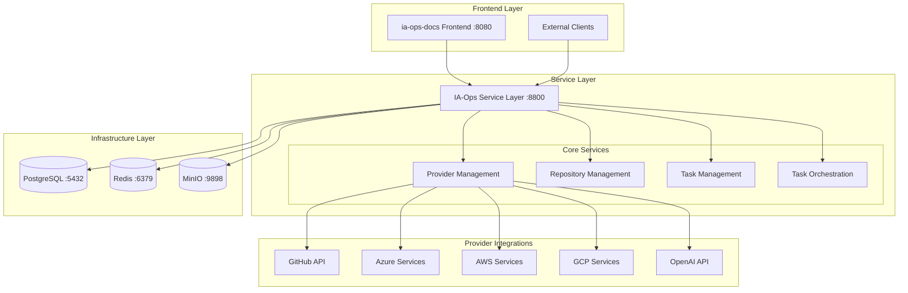

# 🛠️ IA-Ops Dev Core Services

**Ecosistema completo de desarrollo para IA-Ops**: Service Layer unificado con integración GitHub, construcción automática de documentación MkDocs, portal de pruebas, administración de providers (GitHub, Azure, AWS, GCP, OpenAI) y arquitectura limpia.

## 🚀 Arquitectura Service Layer



## 🌟 Características Principales

### 🏗️ **Service Layer Unificado**
- **Puerto único**: 8800 como punto de entrada centralizado
- **API unificada**: Endpoints consistentes con formato estándar
- **Compatibilidad legacy**: Mantiene URLs existentes del frontend
- **Documentación automática**: Swagger UI integrado en `/docs`

### 🔗 **Integración Multi-Provider**
- **GitHub**: Repositorios, organizaciones, tokens
- **Azure**: Subscriptions, Resource Groups, Service Principals
- **AWS**: S3, STS, Access Keys, regiones
- **GCP**: Storage, Service Accounts, proyectos
- **OpenAI**: API Keys, modelos, organizaciones

### 📚 **Sistema de Documentación**
- **Construcción automática** de MkDocs
- **Almacenamiento en MinIO** con URLs directas
- **Configuración automática** si no existe
- **Integración con GitHub** para repositorios

### 🧪 **Portal de Pruebas Integrado**
- **Testing services** integrados en Service Layer
- **Pruebas automatizadas** (unit, integration, performance)
- **Health checks** y monitoreo centralizado
- **Mock services** para desarrollo

### ⚙️ **Administración de Providers**
- **CRUD completo** para gestión de providers
- **Credenciales encriptadas** con rotación
- **Test de conexión** automático
- **Configuración dinámica** por provider

### 🐳 **Despliegue Simplificado**
- **Service Layer único** en contenedor
- **Reutilización** de infraestructura existente
- **Configuración centralizada** en PostgreSQL
- **Health checks** integrados

## 📁 Estructura del Proyecto

```
ia-ops-dev-core/
├── api/                           # Service Layer APIs
│   ├── repository_manager.py          # GitHub + MkDocs + MinIO
│   ├── provider_admin_api.py           # Administración providers
│   ├── github_service.py              # Integración GitHub
│   ├── mkdocs_service.py              # Construcción docs
│   ├── task_manager.py                # Gestión tareas
│   ├── log_manager.py                 # Gestión logs
│   ├── datasync_manager.py            # Sincronización datos
│   ├── swagger_config.py              # Configuración Swagger
│   ├── db_config.py                   # Configuración base datos
│   ├── storage_config.py              # Configuración MinIO
│   ├── models/                        # Modelos de datos
│   │   └── providers.py               # Modelos providers
│   ├── services/                      # Servicios integración
│   │   ├── provider_service.py        # Servicios providers
│   │   └── repository_cloner.py       # Clonado repositorios
│   └── database_enhanced.py           # Modelos PostgreSQL
├── testing-portal/                # Portal de pruebas
│   ├── mock_services.py           # Servicios simulados
│   ├── performance_automation.py  # Pruebas rendimiento
│   ├── clone_test_service.py      # Pruebas clonado
│   └── test_portal_runner.py      # Ejecutor pruebas
├── docs/                          # Documentación MkDocs
│   ├── providers/                 # Docs providers
│   │   └── configuration.md       # Configuración providers
│   └── ...                        # Otras documentaciones
├── service_layer_complete.py      # Service Layer principal
├── docker-compose.yml             # Despliegue unificado
├── Dockerfile.service-layer       # Imagen Service Layer
├── setup_solution.sh              # Script configuración
├── start.sh                       # Script inicio
└── README.md                      # Esta documentación
```

## 🛠️ Instalación y Configuración

### 1. **Clonar Repositorio**
```bash
git clone https://github.com/giovanemere/ia-ops-dev-core.git
cd ia-ops-dev-core
```

### 2. **Configurar Variables de Entorno**
```bash
# Configurar providers (opcional)
export GITHUB_TOKEN="your_github_token"
export AWS_ACCESS_KEY_ID="your_aws_key"
export AZURE_CLIENT_ID="your_azure_client"
export OPENAI_API_KEY="your_openai_key"
```

### 3. **Iniciar Service Layer**
```bash
# Opción 1: Configuración automática
./setup_solution.sh

# Opción 2: Inicio directo
./start.sh

# Opción 3: Docker Compose
docker-compose up -d
```

### 4. **Verificar Servicios**
```bash
# Health check del Service Layer
curl http://localhost:8800/health

# Documentación Swagger
open http://localhost:8800/docs
```

## 🌐 URLs de Acceso

### **Service Layer Principal**
| Servicio | URL | Descripción |
|----------|-----|-------------|
| **Service Layer API** | http://localhost:8800 | API unificada principal |
| **Swagger Documentation** | http://localhost:8800/docs | Documentación automática |
| **Health Check** | http://localhost:8800/health | Estado del sistema |

### **Endpoints Principales**
| Endpoint | Método | Funcionalidad |
|----------|--------|---------------|
| `/api/v1/dashboard` | GET | Datos del dashboard |
| `/api/v1/providers` | GET/POST | Gestión de providers |
| `/api/v1/repositories` | GET/POST | Gestión de repositorios |
| `/api/v1/tasks` | GET/POST | Gestión de tareas |
| `/api/v1/projects` | POST | Creación de proyectos |

### **Compatibilidad Legacy**
| Endpoint Legacy | Nuevo Endpoint | Estado |
|----------------|----------------|--------|
| `/providers` | `/api/v1/providers` | ✅ Compatible |
| `/repository/repositories` | `/api/v1/repositories` | ✅ Compatible |
| `/config/test-connection` | `/api/v1/providers/test-connection` | ✅ Compatible |

### **Infraestructura**
| Componente | Puerto | Acceso |
|------------|--------|--------|
| **PostgreSQL** | 5432 | Base de datos principal |
| **Redis** | 6379 | Cache y colas |
| **MinIO** | 9898 | Almacenamiento docs |
| **MinIO Console** | 9899 | Interfaz web MinIO |

## 🔧 Funcionalidades por Servicio

### 📁 **Repository Manager Enhanced**
```bash
# Listar repositorios GitHub
GET /api/v1/github/repositories?username=octocat

# Crear proyecto completo
POST /api/v1/repositories/projects
{
  "project_name": "Mi Proyecto",
  "project_description": "Descripción del proyecto",
  "github_url": "https://github.com/user/repo.git",
  "branch": "main"
}

# Construir documentación
POST /api/v1/docs/{id}/build
```

### ⚙️ **Provider Administration**
```bash
# Listar providers
GET /api/v1/providers/

# Crear provider GitHub
POST /api/v1/providers/
{
  "name": "GitHub Principal",
  "type": "github",
  "description": "Integración principal con GitHub",
  "config": {
    "token": "ghp_xxxxxxxxxxxxxxxxxxxx",
    "username": "mi-usuario"
  }
}

# Probar conexión
POST /api/v1/config/test-connection
{
  "provider_type": "github",
  "config": {"token": "ghp_xxxxxxxxxxxxxxxxxxxx"}
}

# Obtener requisitos
GET /api/v1/config/requirements/aws
```

### 🧪 **Testing Portal**
```bash
# Health check mock services
GET http://localhost:18860/health  # Repository Manager Mock
GET http://localhost:18861/health  # Task Manager Mock  
GET http://localhost:18862/health  # Log Manager Mock

# Ejecutar pruebas completas
python testing-portal/test_portal_runner.py
```

### 📊 **Task Manager**
```bash
# Gestión de tareas con Redis
POST /api/v1/tasks          # Crear tarea
GET /api/v1/tasks           # Listar tareas
GET /api/v1/tasks/{id}      # Obtener tarea
PUT /api/v1/tasks/{id}      # Actualizar tarea
```

## 🔗 Providers Soportados

### **GitHub Provider**
- **Datos**: Token, username, organization
- **Funciones**: Listar repos, clonar, webhooks
- **Permisos**: repo, read:org, read:user

### **Azure Provider**
- **Datos**: Subscription ID, Client ID, Client Secret, Tenant ID
- **Funciones**: Resource Groups, Storage, VMs
- **Configuración**: Service Principal en Azure AD

### **AWS Provider**
- **Datos**: Access Key ID, Secret Access Key, Region
- **Funciones**: S3, STS, EC2, Lambda
- **Permisos**: IAM policies específicos

### **GCP Provider**
- **Datos**: Project ID, Service Account Key JSON
- **Funciones**: Storage, Compute, BigQuery
- **Configuración**: Service Account con roles

### **OpenAI Provider**
- **Datos**: API Key, Organization ID
- **Funciones**: Modelos, Completions, Embeddings
- **Límites**: Rate limiting por plan

## 🐳 Despliegue Service Layer

### **Imagen Docker Unificada**
```bash
# Construir imagen del Service Layer
docker build -f Dockerfile.service-layer -t ia-ops-service-layer:latest .

# Ejecutar Service Layer
docker run -d \
  --name ia-ops-service-layer \
  -p 8800:8800 \
  --network ia-ops-network \
  ia-ops-service-layer:latest
```

### **Despliegue con Docker Compose**
```bash
# Iniciar todos los servicios
docker-compose up -d

# Verificar estado
docker ps --format "table {{.Names}}\t{{.Status}}\t{{.Ports}}"

# Ver logs del Service Layer
docker logs -f ia-ops-service-layer
```

## 🔗 Integración con Ecosistema IA-Ops

### **Repositorios Relacionados**
- **[ia-ops-docs](https://github.com/giovanemere/ia-ops-docs)** - Frontend principal
- **[ia-ops-minio](https://github.com/giovanemere/ia-ops-minio)** - Almacenamiento
- **[ia-ops-backstage](https://github.com/giovanemere/ia-ops-backstage)** - Portal Backstage
- **[ia-ops-veritas](https://github.com/giovanemere/ia-ops-veritas)** - Portal pruebas unitarias

### **Flujo de Integración**
1. **Frontend (ia-ops-docs)** → Consume APIs via proxy
2. **Backend (ia-ops-dev-core)** → Procesa requests y gestiona datos
3. **Providers** → Integración con GitHub, Azure, AWS, GCP, OpenAI
4. **MinIO** → Almacena documentación construida
5. **PostgreSQL** → Persiste metadatos, providers y configuración
6. **Redis** → Cache y gestión de colas

## 🧪 Pruebas y Testing

### **Ejecutar Pruebas Locales**
```bash
# Pruebas rápidas
python testing-portal/quick_test.py

# Pruebas completas
python testing-portal/test_portal_runner.py

# Pruebas de rendimiento
python testing-portal/performance_automation.py

# Pruebas GitHub
python test_github_functionality.py

# Pruebas Provider Admin
python test_provider_admin.py
```

### **Mock Services**
- **Puerto 18860**: Repository Manager Mock
- **Puerto 18861**: Task Manager Mock  
- **Puerto 18862**: Log Manager Mock
- **Funcionalidades**: CRUD completo, health checks, simulación errores

## 📈 Monitoreo y Logs

### **Health Checks**
```bash
# Verificar todos los servicios
curl http://localhost:8870/health  # Swagger Portal
curl http://localhost:8860/health  # Repository Manager
curl http://localhost:8861/health  # Task Manager
curl http://localhost:8866/api/v1/health/  # Provider Admin
```

### **Logs de Servicios**
```bash
# Ver logs en tiempo real
docker logs -f iaops-repository-manager
docker logs -f iaops-swagger-portal
docker logs -f iaops-provider-admin
docker logs -f iaops-testing-portal
```

## 🚀 Comandos Rápidos

```bash
# Iniciar todo el ecosistema
./setup_solution.sh

# Inicio rápido
./start.sh

# Verificar Service Layer
curl http://localhost:8800/health

# Ver documentación
open http://localhost:8800/docs

# Detener servicios
docker-compose down

# Ver estado
docker ps --format "table {{.Names}}\t{{.Status}}\t{{.Ports}}"
```

## 📄 Documentación Adicional

- **[API_DOCUMENTATION.md](./API_DOCUMENTATION.md)** - Documentación completa de APIs
- **[FRONTEND_INTEGRATION.md](./FRONTEND_INTEGRATION.md)** - Guía integración frontend
- **[USER_STORIES.md](./USER_STORIES.md)** - Historias de usuario
- **[VERITAS_API_SPECS.md](./VERITAS_API_SPECS.md)** - Especificaciones API Veritas
- **[Provider Configuration](./docs/providers/configuration.md)** - Configuración de providers

## 🤝 Contribución

1. Fork el repositorio
2. Crear branch feature (`git checkout -b feature/nueva-funcionalidad`)
3. Commit cambios (`git commit -am 'Add nueva funcionalidad'`)
4. Push branch (`git push origin feature/nueva-funcionalidad`)
5. Crear Pull Request

## 📄 Licencia

Este proyecto está bajo la licencia MIT.

---

**🚀 IA-Ops Dev Core Services - Ecosistema completo de desarrollo con integración multi-provider, GitHub, MkDocs, MinIO y portal de pruebas**
