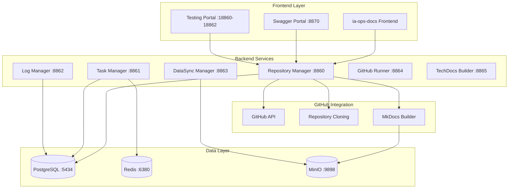

# 🛠️ IA-Ops Dev Core Services

**Ecosistema completo de desarrollo para IA-Ops**: servicios centrales con integración GitHub, construcción automática de documentación MkDocs, portal de pruebas, y despliegue en Docker Hub.

## 🚀 Arquitectura de la Solución



## 🌟 Características Principales

### 🔗 **Integración GitHub Completa**
- **Listado de repositorios** por usuario/organización
- **Clonación automática** de repositorios
- **Construcción MkDocs** con Material theme
- **Subida automática** a MinIO
- **Gestión de proyectos** con estructura completa

### 📚 **Sistema de Documentación**
- **Portal Swagger** centralizado (puerto 8870)
- **Construcción automática** de MkDocs
- **Almacenamiento en MinIO** con URLs directas
- **Configuración automática** si no existe

### 🧪 **Portal de Pruebas Integrado**
- **Mock services** en puertos 18860-18862
- **Pruebas automatizadas** (unit, integration, performance)
- **Simulación realista** de servicios backend
- **Health checks** y monitoreo

### 🐳 **Despliegue Docker Hub**
- **Imágenes versionadas** (v2.0.0)
- **Despliegue en producción** listo
- **Configuración docker-compose** completa
- **Health checks** integrados

## 📁 Estructura del Proyecto

```
ia-ops-dev-core/
├── api/                           # APIs principales
│   ├── repository_manager_enhanced.py  # GitHub + MkDocs + MinIO
│   ├── github_service.py              # Integración GitHub
│   ├── mkdocs_service.py              # Construcción docs
│   ├── task_manager_swagger.py        # Gestión tareas
│   ├── log_manager.py                 # Gestión logs
│   ├── swagger_portal.py              # Portal documentación
│   └── database.py                    # Modelos PostgreSQL
├── testing-portal/                # Portal de pruebas
│   ├── mock_services.py           # Servicios simulados
│   ├── performance_automation.py  # Pruebas rendimiento
│   └── test_portal_runner.py      # Ejecutor pruebas
├── frontend-integration/          # Integración frontend
│   ├── api_client.py              # Cliente API
│   └── frontend_routes.py         # Rutas proxy
├── docker-compose.production.yml  # Despliegue producción
├── build-and-push.sh             # Script Docker Hub
└── README.md                      # Esta documentación
```

## 🛠️ Instalación y Configuración

### 1. **Clonar Repositorio**
```bash
git clone https://github.com/giovanemere/ia-ops-dev-core.git
cd ia-ops-dev-core
```

### 2. **Configurar Variables de Entorno**
```bash
# Copiar configuración
cp docker/.env.example docker/.env

# Configurar GitHub (opcional)
export GITHUB_TOKEN="your_github_token"
```

### 3. **Iniciar Servicios Completos**
```bash
# Opción 1: Desarrollo local
docker-compose -f docker/docker-compose.yml up -d

# Opción 2: Producción con Docker Hub
docker-compose -f docker-compose.production.yml up -d

# Opción 3: Script automatizado
./start-production.sh
```

### 4. **Verificar Servicios**
```bash
./verify-services.sh
```

## 🌐 URLs de Acceso

### **Portales Principales**
| Servicio | URL | Descripción |
|----------|-----|-------------|
| **Swagger Portal** | http://localhost:8870 | Portal centralizado de documentación |
| **Testing Portal** | http://localhost:18860-18862 | Mock services y pruebas |

### **APIs de Servicios**
| Servicio | Puerto | Swagger Docs | Funcionalidad |
|----------|--------|--------------|---------------|
| **Repository Manager** | 8860 | [/docs/](http://localhost:8860/docs/) | GitHub + MkDocs + MinIO |
| **Task Manager** | 8861 | [/docs/](http://localhost:8861/docs/) | Gestión tareas + Redis |
| **Log Manager** | 8862 | [/docs/](http://localhost:8862/docs/) | Visualización logs |
| **DataSync Manager** | 8863 | [/docs/](http://localhost:8863/docs/) | Sincronización datos |
| **GitHub Runner** | 8864 | [/docs/](http://localhost:8864/docs/) | Gestión runners |
| **TechDocs Builder** | 8865 | [/docs/](http://localhost:8865/docs/) | Constructor MkDocs |

### **Infraestructura**
| Componente | Puerto | Acceso |
|------------|--------|--------|
| **PostgreSQL** | 5434 | Base de datos principal |
| **Redis** | 6380 | Cache y colas |
| **MinIO** | 9898 | Almacenamiento docs |
| **MinIO Console** | 9899 | Interfaz web MinIO |

## 🔧 Funcionalidades por Servicio

### 📁 **Repository Manager Enhanced**
```bash
# Listar repositorios GitHub
GET /api/v1/github/repositories?username=octocat

# Crear proyecto completo
POST /api/v1/repositories/projects
{
  "project_name": "Mi Proyecto",
  "project_description": "Descripción del proyecto",
  "github_url": "https://github.com/user/repo.git",
  "branch": "main"
}

# Construir documentación
POST /api/v1/docs/{id}/build
```

### 🧪 **Testing Portal**
```bash
# Health check mock services
GET http://localhost:18860/health  # Repository Manager Mock
GET http://localhost:18861/health  # Task Manager Mock  
GET http://localhost:18862/health  # Log Manager Mock

# Ejecutar pruebas completas
python testing-portal/test_portal_runner.py
```

### 📊 **Task Manager**
```bash
# Gestión de tareas con Redis
POST /api/v1/tasks          # Crear tarea
GET /api/v1/tasks           # Listar tareas
GET /api/v1/tasks/{id}      # Obtener tarea
PUT /api/v1/tasks/{id}      # Actualizar tarea
```

## 🐳 Docker Hub Images

### **Imágenes Disponibles (v2.0.0)**
```bash
# Pull imágenes desde Docker Hub
docker pull edissonz8809/ia-ops-repository-manager:2.0.0
docker pull edissonz8809/ia-ops-task-manager:2.0.0
docker pull edissonz8809/ia-ops-log-manager:2.0.0
docker pull edissonz8809/ia-ops-datasync-manager:2.0.0
docker pull edissonz8809/ia-ops-github-runner:2.0.0
docker pull edissonz8809/ia-ops-techdocs-builder:2.0.0
docker pull edissonz8809/ia-ops-swagger-portal:2.0.0
docker pull edissonz8809/ia-ops-testing-portal:2.0.0
```

### **Despliegue Producción**
```bash
# Usar imágenes Docker Hub
docker-compose -f docker-compose.production.yml up -d

# Verificar estado
docker ps --format "table {{.Names}}\t{{.Status}}\t{{.Ports}}"
```

## 🔗 Integración con Ecosistema IA-Ops

### **Repositorios Relacionados**
- **[ia-ops-docs](https://github.com/giovanemere/ia-ops-docs)** - Frontend principal
- **[ia-ops-minio](https://github.com/giovanemere/ia-ops-minio)** - Almacenamiento
- **[ia-ops-backstage](https://github.com/giovanemere/ia-ops-backstage)** - Portal Backstage
- **[ia-ops-veritas](https://github.com/giovanemere/ia-ops-veritas)** - Portal pruebas unitarias

### **Flujo de Integración**
1. **Frontend (ia-ops-docs)** → Consume APIs via proxy
2. **Backend (ia-ops-dev-core)** → Procesa requests y gestiona datos
3. **GitHub** → Clona repositorios y construye docs
4. **MinIO** → Almacena documentación construida
5. **PostgreSQL** → Persiste metadatos y configuración
6. **Redis** → Cache y gestión de colas

## 🧪 Pruebas y Testing

### **Ejecutar Pruebas Locales**
```bash
# Pruebas rápidas
python testing-portal/quick_test.py

# Pruebas completas
python testing-portal/test_portal_runner.py

# Pruebas de rendimiento
python testing-portal/performance_automation.py

# Pruebas GitHub
python test_github_functionality.py
```

### **Mock Services**
- **Puerto 18860**: Repository Manager Mock
- **Puerto 18861**: Task Manager Mock  
- **Puerto 18862**: Log Manager Mock
- **Funcionalidades**: CRUD completo, health checks, simulación errores

## 📈 Monitoreo y Logs

### **Health Checks**
```bash
# Verificar todos los servicios
curl http://localhost:8870/health  # Swagger Portal
curl http://localhost:8860/health  # Repository Manager
curl http://localhost:8861/health  # Task Manager
```

### **Logs de Servicios**
```bash
# Ver logs en tiempo real
docker logs -f iaops-repository-manager
docker logs -f iaops-swagger-portal
docker logs -f iaops-testing-portal
```

## 🚀 Comandos Rápidos

```bash
# Iniciar todo el ecosistema
./start-production.sh

# Verificar servicios
./verify-services.sh

# Construir y subir a Docker Hub
./build-and-push.sh

# Detener servicios
docker-compose -f docker-compose.production.yml down

# Ver estado
docker ps --format "table {{.Names}}\t{{.Status}}\t{{.Ports}}"
```

## 📄 Documentación Adicional

- **[API_DOCUMENTATION.md](./API_DOCUMENTATION.md)** - Documentación completa de APIs
- **[FRONTEND_INTEGRATION.md](./FRONTEND_INTEGRATION.md)** - Guía integración frontend
- **[USER_STORIES.md](./USER_STORIES.md)** - Historias de usuario
- **[VERITAS_API_SPECS.md](./VERITAS_API_SPECS.md)** - Especificaciones API Veritas

## 🤝 Contribución

1. Fork el repositorio
2. Crear branch feature (`git checkout -b feature/nueva-funcionalidad`)
3. Commit cambios (`git commit -am 'Add nueva funcionalidad'`)
4. Push branch (`git push origin feature/nueva-funcionalidad`)
5. Crear Pull Request

## 📄 Licencia

Este proyecto está bajo la licencia MIT.

---

**🚀 IA-Ops Dev Core Services - Ecosistema completo de desarrollo con integración GitHub, MkDocs, MinIO y portal de pruebas**
