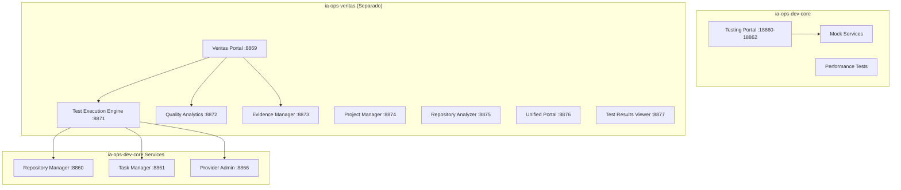

# Ubicación de Servicios de Pruebas

## 🎯 Servicios de Pruebas en IA-Ops Dev Core

### **Testing Portal (Actual)**
- **Ubicación**: `ia-ops-dev-core/testing-portal/`
- **Repositorio**: Este mismo (ia-ops-dev-core)
- **Puertos**: 18860-18862
- **Propósito**: Mock services para desarrollo local

```
ia-ops-dev-core/
├── testing-portal/
│   ├── mock_services.py          # Mock services principales
│   ├── performance_automation.py # Pruebas de rendimiento
│   ├── test_portal_runner.py     # Ejecutor de pruebas
│   ├── quick_test.py             # Pruebas rápidas
│   ├── simple_mock.py            # Mock simple
│   └── final_test.py             # Pruebas finales
```

### **IA-Ops Veritas (Separado)**
- **Repositorio**: `git@github.com:giovanemere/ia-ops-veritas.git`
- **Propósito**: Portal completo de pruebas unitarias y QA
- **Integración**: Consume APIs de ia-ops-dev-core

## 🔄 Diferencias y Propósitos

### **Testing Portal (ia-ops-dev-core)**
```bash
# Servicios mock para desarrollo
GET http://localhost:18860/health  # Repository Manager Mock
GET http://localhost:18861/health  # Task Manager Mock
GET http://localhost:18862/health  # Log Manager Mock

# Propósito: Desarrollo y testing local
python testing-portal/mock_services.py
python testing-portal/quick_test.py
```

### **IA-Ops Veritas (Repositorio separado)**
```bash
# Portal completo de QA
git clone git@github.com:giovanemere/ia-ops-veritas.git

# Funcionalidades:
- Test Execution Engine
- Quality Analytics
- Evidence Manager
- Repository Analyzer
- Project Manager
- Test Results Viewer
- Unified Portal
```

## 🏗️ Arquitectura de Testing



## 📊 Servicios por Repositorio

### **ia-ops-dev-core/testing-portal/**
| Servicio | Puerto | Propósito |
|----------|--------|-----------|
| Repository Manager Mock | 18860 | Simular Repository Manager |
| Task Manager Mock | 18861 | Simular Task Manager |
| Log Manager Mock | 18862 | Simular Log Manager |

**Características:**
- Mock services simples
- Desarrollo local
- Pruebas rápidas
- Integrado en docker-compose

### **ia-ops-veritas (Repositorio separado)**
| Servicio | Puerto | Propósito |
|----------|--------|-----------|
| Veritas Portal | 8869 | Portal principal de QA |
| Test Execution Engine | 8871 | Motor de ejecución de pruebas |
| Quality Analytics | 8872 | Análisis de calidad |
| Evidence Manager | 8873 | Gestión de evidencias |
| Project Manager | 8874 | Gestión de proyectos de testing |
| Repository Analyzer | 8875 | Análisis de repositorios |
| Unified Portal | 8876 | Portal unificado |
| Test Results Viewer | 8877 | Visualización de resultados |

**Características:**
- Portal completo de QA
- Pruebas unitarias avanzadas
- Análisis de calidad
- Gestión de evidencias
- Reportes detallados

## 🚀 Uso Recomendado

### **Para Desarrollo Local**
```bash
# Usar testing-portal en ia-ops-dev-core
cd ia-ops-dev-core
docker-compose up testing-portal

# Pruebas rápidas
python testing-portal/quick_test.py
```

### **Para QA Completo**
```bash
# Clonar y usar ia-ops-veritas
git clone git@github.com:giovanemere/ia-ops-veritas.git
cd ia-ops-veritas
docker-compose up

# Acceder al portal
http://localhost:8869
```

## 🔗 Integración entre Repositorios

### **ia-ops-veritas → ia-ops-dev-core**
```yaml
# En ia-ops-veritas docker-compose.yml
environment:
  - IAOPS_CORE_BASE_URL=http://localhost:8860
  - IAOPS_PROVIDER_ADMIN_URL=http://localhost:8866
  - IAOPS_TASK_MANAGER_URL=http://localhost:8861
```

### **Configuración de Testing**
```python
# En ia-ops-veritas
IAOPS_SERVICES = {
    'repository_manager': 'http://localhost:8860',
    'task_manager': 'http://localhost:8861',
    'provider_admin': 'http://localhost:8866',
    'swagger_portal': 'http://localhost:8870'
}
```

## 📝 Resumen

### **Testing Portal (ia-ops-dev-core)**
- ✅ **Ubicación**: Este repositorio
- ✅ **Propósito**: Mock services para desarrollo
- ✅ **Acceso**: http://localhost:18860-18862
- ✅ **Uso**: Desarrollo local y pruebas rápidas

### **IA-Ops Veritas (Separado)**
- ✅ **Ubicación**: `git@github.com:giovanemere/ia-ops-veritas.git`
- ✅ **Propósito**: Portal completo de QA y pruebas unitarias
- ✅ **Acceso**: http://localhost:8869
- ✅ **Uso**: Testing avanzado y análisis de calidad

**Ambos repositorios se complementan**: ia-ops-dev-core proporciona los servicios core y mocks básicos, mientras que ia-ops-veritas proporciona el portal completo de testing y QA.
