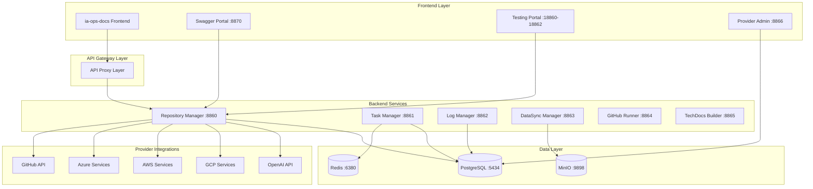
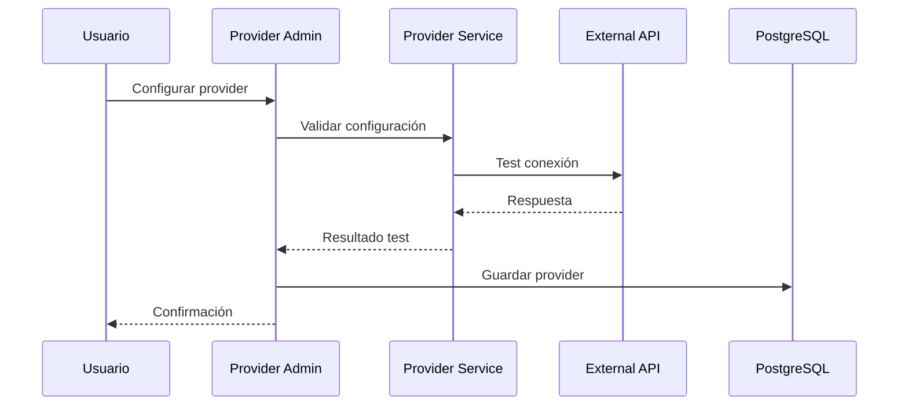
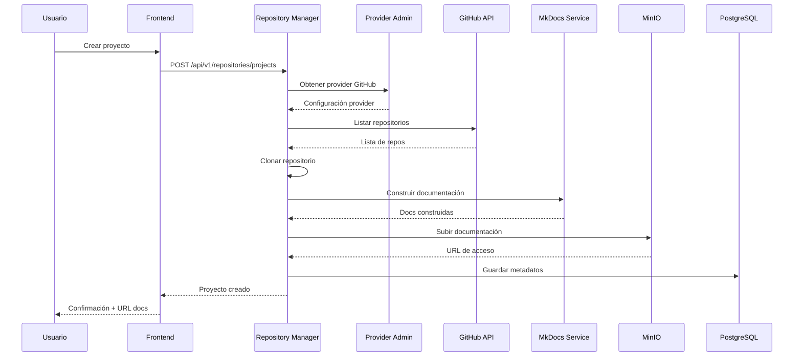
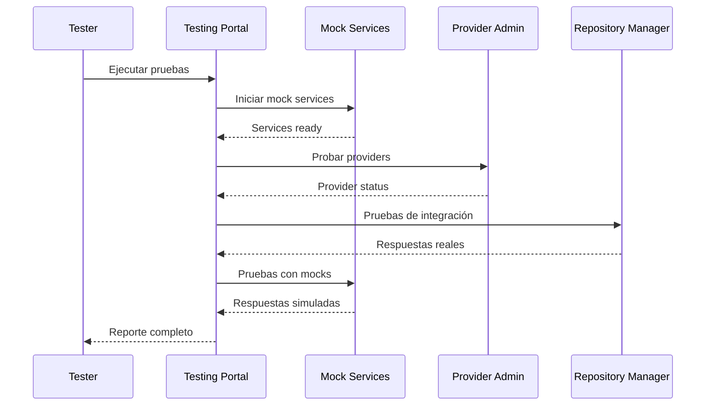

# Arquitectura del Sistema

IA-Ops Dev Core Services está diseñado como un ecosistema modular y escalable que integra múltiples servicios para proporcionar una plataforma completa de desarrollo con soporte multi-provider.

## 🏗️ Visión General

## 🎯 Principios de Diseño

### 1. **Modularidad**
- Cada servicio es independiente y puede desplegarse por separado
- Comunicación a través de APIs REST bien definidas
- Interfaces estándar con Swagger/OpenAPI

### 2. **Multi-Provider**
- Soporte para múltiples proveedores de servicios
- Configuración dinámica de providers
- Abstracción de APIs específicas de cada proveedor

### 3. **Escalabilidad**
- Servicios containerizados con Docker
- Balanceador de carga integrado
- Cache distribuido con Redis

### 4. **Observabilidad**
- Logs centralizados
- Health checks en todos los servicios
- Métricas de rendimiento

### 5. **Seguridad**
- Autenticación por tokens
- Encriptación de credenciales
- Validación de entrada

## 🔧 Componentes Principales

### Frontend Layer

#### **ia-ops-docs Frontend**
- **Tecnología**: React/Vue.js
- **Puerto**: Variable
- **Función**: Interface de usuario principal
- **Integración**: Consume APIs a través del proxy layer

#### **Swagger Portal**
- **Tecnología**: Flask + Swagger UI
- **Puerto**: 8870
- **Función**: Documentación centralizada de APIs
- **Características**: 
  - Estado en tiempo real de servicios
  - Pruebas interactivas de endpoints
  - Documentación auto-generada

#### **Provider Admin Portal**
- **Tecnología**: Flask + RestX
- **Puerto**: 8866
- **Función**: Administración de providers multi-cloud
- **Características**:
  - CRUD completo de providers
  - Test de conexión automático
  - Gestión de credenciales encriptadas

#### **Testing Portal**
- **Tecnología**: Flask + Mock Services
- **Puertos**: 18860-18862
- **Función**: Entorno de pruebas aislado
- **Características**:
  - Mock services realistas
  - Simulación de errores
  - Health checks automatizados

### Backend Services

#### **Repository Manager Enhanced**
- **Puerto**: 8860
- **Función**: Gestión completa de repositorios y documentación
- **Integraciones**:
  - GitHub API para listado y clonación
  - MkDocs para construcción de documentación
  - MinIO para almacenamiento
  - PostgreSQL para metadatos
  - Provider Admin para configuración

#### **Provider Administration**
- **Puerto**: 8866
- **Función**: Gestión centralizada de providers
- **Características**:
  - Soporte para GitHub, Azure, AWS, GCP, OpenAI
  - Credenciales encriptadas
  - Test de conexión automático
  - Configuración dinámica

#### **Task Manager**
- **Puerto**: 8861
- **Función**: Gestión de tareas y colas de trabajo
- **Características**:
  - Cola de tareas con Redis
  - Retry automático
  - Monitoreo de progreso
  - Logs detallados

#### **Log Manager**
- **Puerto**: 8862
- **Función**: Centralización y visualización de logs
- **Características**:
  - Agregación de logs
  - Filtros avanzados
  - Exportación de datos
  - Dashboard de métricas

### Provider Integrations

#### **GitHub Integration**
- **Funciones**: Repositorios, organizaciones, webhooks
- **Autenticación**: Personal Access Tokens
- **Permisos**: repo, read:org, read:user

#### **Azure Integration**
- **Funciones**: Resource Groups, Storage, VMs
- **Autenticación**: Service Principal
- **Configuración**: Client ID, Secret, Tenant ID

#### **AWS Integration**
- **Funciones**: S3, STS, EC2, Lambda
- **Autenticación**: Access Keys
- **Permisos**: IAM policies específicos

#### **GCP Integration**
- **Funciones**: Storage, Compute, BigQuery
- **Autenticación**: Service Account
- **Configuración**: Project ID, Key JSON

#### **OpenAI Integration**
- **Funciones**: Modelos, Completions, Embeddings
- **Autenticación**: API Key
- **Límites**: Rate limiting por plan

### Data Layer

#### **PostgreSQL**
- **Puerto**: 5434
- **Función**: Base de datos principal
- **Esquemas**:
  - Repositorios y metadatos
  - Providers y credenciales
  - Tareas y estados
  - Logs y auditoría
  - Configuraciones

#### **Redis**
- **Puerto**: 6380
- **Función**: Cache y colas
- **Uso**:
  - Cache de sesiones
  - Cola de tareas
  - Cache de consultas frecuentes
  - Pub/Sub para notificaciones

#### **MinIO**
- **Puerto**: 9898-9899
- **Función**: Almacenamiento de objetos
- **Contenido**:
  - Documentación construida
  - Archivos de repositorios
  - Backups
  - Assets estáticos

## 🔄 Flujos de Datos

### Flujo de Configuración de Provider

### Flujo de Creación de Proyecto con Provider

### Flujo de Testing Multi-Provider

## 🚀 Patrones de Arquitectura

### 1. **Microservicios**
- Servicios independientes y especializados
- Comunicación asíncrona cuando es posible
- Tolerancia a fallos

### 2. **API-First**
- Todas las funcionalidades expuestas via API
- Documentación Swagger completa
- Versionado de APIs

### 3. **Multi-Tenant Provider**
- Soporte para múltiples providers del mismo tipo
- Configuración por tenant/organización
- Aislamiento de credenciales

### 4. **Event-Driven**
- Notificaciones asíncronas
- Pub/Sub con Redis
- Procesamiento de eventos

### 5. **CQRS (Command Query Responsibility Segregation)**
- Separación de operaciones de lectura y escritura
- Optimización específica por tipo de operación
- Cache inteligente

## 🔒 Seguridad

### Autenticación y Autorización
- Tokens JWT para autenticación
- RBAC (Role-Based Access Control)
- Rate limiting por endpoint

### Gestión de Credenciales
- Encriptación de credenciales de providers
- Rotación automática de tokens
- Auditoría de acceso a credenciales

### Comunicación Segura
- HTTPS en producción
- Validación de certificados
- Encriptación de datos sensibles

### Validación de Datos
- Validación de entrada en todos los endpoints
- Sanitización de datos
- Prevención de inyección SQL

## 📊 Monitoreo y Observabilidad

### Health Checks
- Endpoint `/health` en todos los servicios
- Verificación de dependencias
- Estado de conexiones a providers
- Estado de conexiones a bases de datos

### Logging
- Logs estructurados en JSON
- Niveles de log configurables
- Agregación centralizada
- Auditoría de operaciones con providers

### Métricas
- Métricas de rendimiento por servicio
- Contadores de requests por provider
- Tiempo de respuesta por API externa
- Uso de credenciales y rate limits

## 🔄 Escalabilidad

### Horizontal Scaling
- Servicios stateless
- Load balancing automático
- Auto-scaling basado en métricas

### Vertical Scaling
- Configuración de recursos por servicio
- Optimización de memoria y CPU
- Tuning de bases de datos

### Caching Strategy
- Cache de aplicación con Redis
- Cache de respuestas de providers
- Cache de base de datos
- CDN para assets estáticos

### Provider Load Balancing
- Distribución de carga entre providers del mismo tipo
- Failover automático entre providers
- Rate limiting por provider

## 🚀 Próximos Pasos

- [**Servicios**](services.md) - Detalles de cada servicio
- [**Integración**](integration.md) - Patrones de integración
- [**APIs**](../apis/repository-manager.md) - Documentación de endpoints
- [**Providers**](../providers/configuration.md) - Configuración de providers
