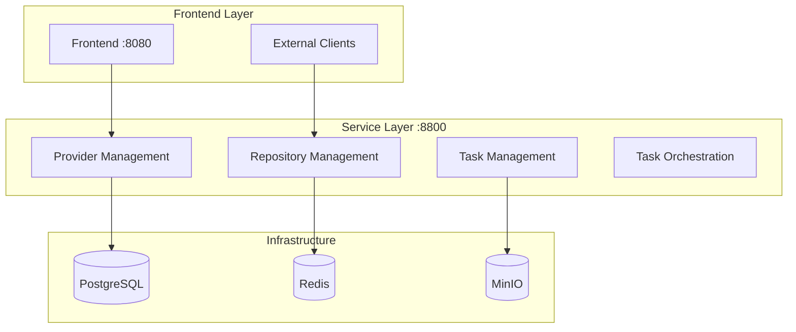

# IA-Ops Dev Core Services

**Ecosistema completo de desarrollo para IA-Ops**: Service Layer unificado con integración GitHub, construcción automática de documentación MkDocs, portal de pruebas, administración de providers (GitHub, Azure, AWS, GCP, OpenAI) y arquitectura limpia.

## 🚀 Quick Start

### 1. Clone Repository
```bash
git clone https://github.com/giovanemere/ia-ops-dev-core.git
cd ia-ops-dev-core
```

### 2. Start Service Layer
```bash
# Automatic setup
./setup_solution.sh

# Or direct start
./start.sh

# Or Docker Compose
docker-compose up -d
```

### 3. Verify Services
```bash
# Health check
curl http://localhost:8800/health

# API documentation
open http://localhost:8800/docs
```

## 🏗️ Architecture Overview

The IA-Ops Dev Core implements a **Service Layer** architecture that provides:

- **Unified API**: Single entry point (port 8800) for all services
- **Multi-Provider Integration**: GitHub, Azure, AWS, GCP, OpenAI
- **Automatic Documentation**: MkDocs building and MinIO storage
- **Testing Portal**: Integrated testing and mock services
- **Clean Architecture**: Separation of concerns and reusable components



## 🌟 Key Features

### 🔗 Multi-Provider Integration
- **GitHub**: Repositories, organizations, tokens
- **Azure**: Subscriptions, Resource Groups, Service Principals  
- **AWS**: S3, STS, Access Keys, regions
- **GCP**: Storage, Service Accounts, projects
- **OpenAI**: API Keys, models, organizations

### 📚 Documentation System
- **Automatic MkDocs building** from GitHub repositories
- **MinIO storage** with direct URLs
- **Auto-configuration** if mkdocs.yml doesn't exist
- **GitHub integration** for repository management

### 🧪 Integrated Testing Portal
- **Testing services** integrated in Service Layer
- **Automated testing** (unit, integration, performance)
- **Health checks** and centralized monitoring
- **Mock services** for development

### ⚙️ Provider Administration
- **Complete CRUD** for provider management
- **Encrypted credentials** with rotation
- **Automatic connection testing**
- **Dynamic configuration** per provider

## 🌐 API Endpoints

### Core Services
| Endpoint | Method | Description |
|----------|--------|-------------|
| `/api/v1/dashboard` | GET | Dashboard data |
| `/api/v1/providers` | GET/POST | Provider management |
| `/api/v1/repositories` | GET/POST | Repository management |
| `/api/v1/tasks` | GET/POST | Task management |
| `/api/v1/projects` | POST | Complete project creation |

### Legacy Compatibility
| Legacy Endpoint | New Endpoint | Status |
|----------------|--------------|--------|
| `/providers` | `/api/v1/providers` | ✅ Compatible |
| `/repository/repositories` | `/api/v1/repositories` | ✅ Compatible |
| `/config/test-connection` | `/api/v1/providers/test-connection` | ✅ Compatible |

## 📊 Service URLs

| Service | URL | Description |
|---------|-----|-------------|
| **Service Layer API** | http://localhost:8800 | Main unified API |
| **Swagger Documentation** | http://localhost:8800/docs | Auto-generated docs |
| **Health Check** | http://localhost:8800/health | System status |

## 🔧 Configuration

### Environment Variables
```bash
# Optional provider configuration
export GITHUB_TOKEN="your_github_token"
export AWS_ACCESS_KEY_ID="your_aws_key"
export AZURE_CLIENT_ID="your_azure_client"
export OPENAI_API_KEY="your_openai_key"
```

### Infrastructure
- **PostgreSQL**: Port 5432 (existing database reused)
- **Redis**: Port 6379 (cache and queues)
- **MinIO**: Port 9898 (document storage)

## 🧪 Testing

### Quick Tests
```bash
# Quick test
python testing-portal/quick_test.py

# Complete tests
python testing-portal/test_portal_runner.py

# Performance tests
python testing-portal/performance_automation.py
```

### Mock Services
- **Port 18860**: Repository Manager Mock
- **Port 18861**: Task Manager Mock  
- **Port 18862**: Log Manager Mock

## 📈 Monitoring

### Health Checks
```bash
# Service Layer health
curl http://localhost:8800/health

# Individual service health
curl http://localhost:8800/api/v1/providers/health
curl http://localhost:8800/api/v1/repositories/health
curl http://localhost:8800/api/v1/tasks/health
```

### Logs
```bash
# View Service Layer logs
docker logs -f ia-ops-service-layer

# View all service logs
docker-compose logs -f
```

## 🚀 Quick Commands

```bash
# Start ecosystem
./setup_solution.sh

# Quick start
./start.sh

# Verify Service Layer
curl http://localhost:8800/health

# View documentation
open http://localhost:8800/docs

# Stop services
docker-compose down
```

## 📚 Documentation

- **[Service Layer Architecture](architecture/service-layer.md)** - Detailed architecture
- **[API Documentation](api/overview.md)** - Complete API reference
- **[Provider Configuration](providers/configuration.md)** - Provider setup
- **[Development Guide](development/getting-started.md)** - Development setup

## 🤝 Contributing

1. Fork the repository
2. Create feature branch (`git checkout -b feature/new-feature`)
3. Commit changes (`git commit -am 'Add new feature'`)
4. Push branch (`git push origin feature/new-feature`)
5. Create Pull Request

## 📄 License

This project is licensed under the MIT License.

---

**🚀 IA-Ops Dev Core Services - Complete development ecosystem with multi-provider integration, GitHub, MkDocs, MinIO and testing portal**
