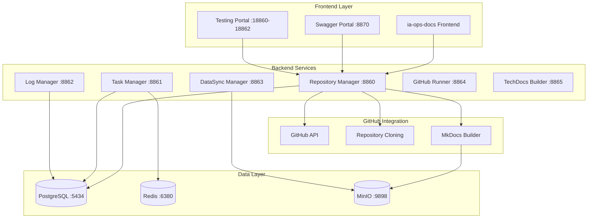

# IA-Ops Dev Core Services

Bienvenido al **ecosistema completo de desarrollo para IA-Ops**, que incluye servicios centrales con integración GitHub, construcción automática de documentación MkDocs, portal de pruebas, y despliegue en Docker Hub.

## 🚀 Características Principales

### 🔗 Integración GitHub Completa
- Listado de repositorios por usuario/organización
- Clonación automática de repositorios
- Construcción MkDocs con Material theme
- Subida automática a MinIO
- Gestión de proyectos con estructura completa

### 📚 Sistema de Documentación
- Portal Swagger centralizado (puerto 8870)
- Construcción automática de MkDocs
- Almacenamiento en MinIO con URLs directas
- Configuración automática si no existe

### 🧪 Portal de Pruebas Integrado
- Mock services en puertos 18860-18862
- Pruebas automatizadas (unit, integration, performance)
- Simulación realista de servicios backend
- Health checks y monitoreo

### 🐳 Despliegue Docker Hub
- Imágenes versionadas (v2.0.0)
- Despliegue en producción listo
- Configuración docker-compose completa
- Health checks integrados

## 🏗️ Arquitectura



## 🌐 URLs de Acceso

### Portales Principales
| Servicio | URL | Descripción |
|----------|-----|-------------|
| **Swagger Portal** | http://localhost:8870 | Portal centralizado de documentación |
| **Testing Portal** | http://localhost:18860-18862 | Mock services y pruebas |

### APIs de Servicios
| Servicio | Puerto | Swagger Docs | Funcionalidad |
|----------|--------|--------------|---------------|
| **Repository Manager** | 8860 | [/docs/](http://localhost:8860/docs/) | GitHub + MkDocs + MinIO |
| **Task Manager** | 8861 | [/docs/](http://localhost:8861/docs/) | Gestión tareas + Redis |
| **Log Manager** | 8862 | [/docs/](http://localhost:8862/docs/) | Visualización logs |
| **DataSync Manager** | 8863 | [/docs/](http://localhost:8863/docs/) | Sincronización datos |
| **GitHub Runner** | 8864 | [/docs/](http://localhost:8864/docs/) | Gestión runners |
| **TechDocs Builder** | 8865 | [/docs/](http://localhost:8865/docs/) | Constructor MkDocs |

## 🚀 Inicio Rápido

### 1. Instalación
```bash
git clone https://github.com/giovanemere/ia-ops-dev-core.git
cd ia-ops-dev-core
```

### 2. Configuración
```bash
cp docker/.env.example docker/.env
export GITHUB_TOKEN="your_github_token"  # Opcional
```

### 3. Despliegue
```bash
# Producción con Docker Hub
docker-compose -f docker-compose.production.yml up -d

# O usar script automatizado
./start-production.sh
```

### 4. Verificación
```bash
./verify-services.sh
```

## 📊 Servicios Disponibles

### Repository Manager Enhanced
- **Puerto**: 8860
- **Funcionalidad**: Integración completa con GitHub, construcción MkDocs, subida a MinIO
- **Endpoints principales**:
  - `GET /api/v1/github/repositories` - Listar repos GitHub
  - `POST /api/v1/repositories/projects` - Crear proyecto completo
  - `POST /api/v1/docs/{id}/build` - Construir documentación

### Task Manager
- **Puerto**: 8861
- **Funcionalidad**: Gestión de tareas con Redis
- **Características**: Cola de tareas, monitoreo, retry automático

### Testing Portal
- **Puertos**: 18860-18862
- **Funcionalidad**: Mock services para desarrollo y testing
- **Características**: Simulación realista, health checks, CRUD completo

## 🐳 Docker Hub Images

Todas las imágenes están disponibles en Docker Hub con versión 2.0.0:

```bash
docker pull edissonz8809/ia-ops-repository-manager:2.0.0
docker pull edissonz8809/ia-ops-task-manager:2.0.0
docker pull edissonz8809/ia-ops-swagger-portal:2.0.0
docker pull edissonz8809/ia-ops-testing-portal:2.0.0
# ... y más
```

## 📚 Documentación

- [**Guía de Instalación**](getting-started/installation.md) - Configuración paso a paso
- [**Arquitectura**](architecture/overview.md) - Diseño del sistema
- [**APIs**](apis/repository-manager.md) - Documentación de endpoints
- [**Testing**](testing/testing-portal.md) - Portal de pruebas
- [**Despliegue**](deployment/docker-hub.md) - Producción con Docker Hub

## 🤝 Contribución

1. Fork el repositorio
2. Crear branch feature
3. Commit cambios
4. Push branch
5. Crear Pull Request

---

**🚀 IA-Ops Dev Core Services - Ecosistema completo de desarrollo**
